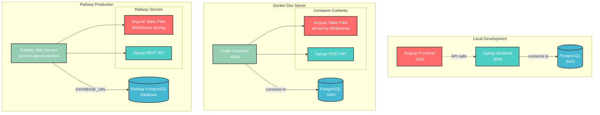

# Grocery List Manager

A full-stack web application for managing family grocery lists with sharing features.


## Live Demo

**Production App**: [https://grocery-app-production-bc43.up.railway.app/](https://grocery-app-production-bc43.up.railway.app/)

**Test Credentials:**

- Username: `john_doe` | Password: `password123`
- Username: `jane_smith` | Password: `password123`
- Username: `admin` | Password: `admin123` (admin access)

## Quick Start

### Option 1: Docker Setup (Recommended)

**Prerequisites**

- [Docker Desktop](https://www.docker.com/products/docker-desktop/) installed and running

**Setup**

```bash
# Clone the repository
git clone https://github.com/cathy-dctp/grocery-app.git
cd grocery-app

# Start all services
docker-compose up
```

The app will be running at [http://localhost:8000](http://localhost:8000)

- Frontend and backend served from single container
- PostgreSQL database automatically configured
- Test data pre-loaded with sample grocery lists
- Production-ready deployment configuration

### Option 2: Local Development Setup

For local development with separate frontend/backend servers, see detailed instructions in:

**📖 [Development Guide - Option 2](DEV_GUIDE.md#option-2-local-development-setup)**

### API Documentation

For complete API documentation including all endpoints, authentication, and usage examples, see:

**📖 [API Documentation](API_DOCUMENTATION.md)**

**Quick Start API Example:**

```bash
# Login to get authentication token
curl -X POST http://localhost:8000/api/auth/login/ \
  -H "Content-Type: application/json" \
  -d '{"username": "john_doe", "password": "password123"}'

# Use token for authenticated requests
TOKEN="your_token_here"
curl -H "Authorization: Token $TOKEN" \
  http://localhost:8000/api/grocery-lists/
```

## Core Features

**Essential grocery management** with user authentication, multiple lists, and family collaboration.

### User Authentication

- Signup/Login/Logout with token-based authentication
- User-specific data filtering and route protection

### List Management

- Create and manage multiple grocery lists
- Autocomplete suggestions from existing items database
- Custom item names (e.g., "Organic Bananas" instead of just "Bananas")
- Flexible quantities and units per item

### Family Collaboration

- Share lists with other family members
- Collaboration on shared grocery lists

### User Experience

- Working interface on both desktop and mobile web

## Technical Stack

### Frontend

- **Angular 20** with TypeScript for type safety
- **Tailwind CSS** for responsive styling
- **Standalone Components** architecture
- **RxJS** for reactive programming
- **Authentication Guards** and HTTP interceptors

### Backend

- **Django 4.2** with Django REST Framework
- **PostgreSQL** database with proper relationships
- **Token-based authentication**
- **WhiteNoise** for static file serving

### DevOps & Deployment

- **Docker** containerization with multi-stage builds
- **Railway** cloud deployment
- **Automated testing** with comprehensive test suite

## Architecture Diagram

### Deployment Overview



## Development Approach

### Technology Stack Selection

I chose Django + Angular + PostgreSQL specifically to align with RideCo's technology stack and demonstrate my ability to rapidly learn and implement solutions with technologies that were new to me.

### Disclaimer: AI-Assisted Development

This project was built with the help of generated AI as a learning accelerator and coding companion but I make sure that I understand the generated code and guide the AI so that the code is robust and well-tested. I make sure all the app ideas are from my own and only use AI to prototype and understand best practices in Django and Angular. Particularly for the extensive test suite (147+ tests) I designed and reviewed but had AI implement to ensure full coverage within project timelines.

## Testing

CI/CD pipeline setup on Github https://github.com/cathy-dctp/grocery-app/actions

**Backend Testing** (Django TestCase, Factory Boy)

```bash
# Run all backend tests
make test
```

**Frontend Testing** (Jasmine/Karma for unit tests)

```bash
# Run all frontend tests
cd frontend && npm install && npm test
```

**End-to-End Testing** (Cypress)

Note: Cypress is not working fully due to time constraint

```bash
cd frontend && npm run e2e
```

## Code Quality & Linting

The project uses ESLint + Prettier (frontend) and Flake8 + Black + isort (backend) for code quality.

For detailed linting and formatting commands, see:

**📖 [Development Guide - Code Quality](DEV_GUIDE.md#code-quality--linting)**

## Known Issues & Future Enhancements

For current limitations, known issues, and planned feature enhancements, see:

**[Known Issues & Wishlist Features](DISCUSSIONS.md)**

